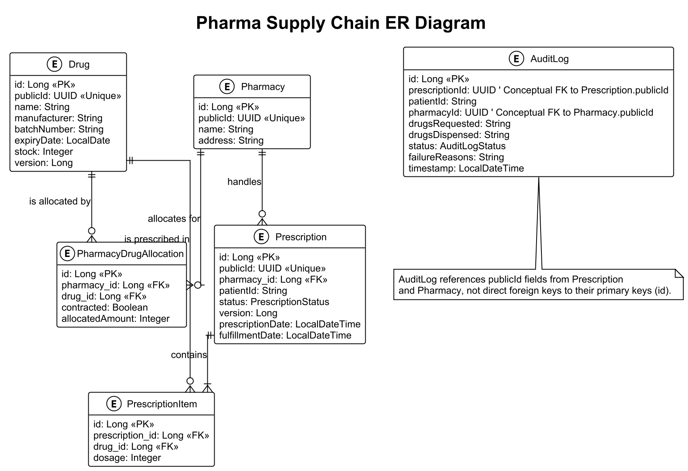

# Project Overview

This system is a comprehensive pharmaceutical prescription management solution designed to handle drug inventory,
pharmacy management, prescription processing, and audit logging. The system provides a complete workflow for processing
prescriptions from creation to fulfillment, with built-in validation and audit capabilities.

## 1 Project structure

The project follows a standard Spring Boot application structure with the following key components:

- **Controllers**: Handle HTTP requests and responses. Depends on the service layer to perform business logic.
- **Services**: Contain business logic. Depends on the repository layer to interact with the database.
- **Repositories**: Interface with the database.
- **Entities**: Represent database tables. POJOs with JPA annotations.
- **DTOs**: Data Transfer Objects for API communication.

Full files structure:

``` text
pharmacy_challenge/  
├── config/ # Configuration files  
│ └── checkstyle.xml # Code style rules configuration  
├── src/  
│ ├── main/  
│ │ ├── java/com/pharma/prescription/  
│ │ │ ├── PrescriptionApplication.java # Spring Boot application entry point  
│ │ │ ├── controller/ # REST API endpoints  
│ │ │ ├── dto/ # Data Transfer Objects for API requests/responses  
│ │ │ ├── entity/ # JPA entities representing database tables  
│ │ │ ├── repository/ # Data access layer interfaces  
│ │ │ ├── service/ # Business logic implementation  
│ │ │ └── shared/ # Shared utilities and helpers  
│ │ └── resources/  
│ │ ├── application.properties # Application configuration properties  
│ │ └── db/migration/ # Flyway database migration scripts  
│ └── test/ # Test code directory  
└── build.gradle # Gradle build configuration for the project 
```

## 2 Tech Stack

| Component             | Technology                     | 
|-----------------------|--------------------------------|
| Application Framework | Spring Boot 3.4.5              |
| API Documentation     | SpringDoc OpenAPI (Swagger UI) |
| Database              | PostgreSQL                     |
| Database Migration    | Flyway                         |
| ORM                   | Spring Data JPA / Hibernate    |
| Build Tool            | Gradle                         |
| Linting               | Checkstyle                     |
| Testing               | JUnit, Mockito                 |

## 3 Development Environment

### 3.1 Prerequisites

To work on this project, you need the following components installed on your computer:

| Component  | Version | Notes                                                         |
|------------|---------|---------------------------------------------------------------|
| JDK        | 17      | The project uses Java 17 language features                    |
| PostgreSQL | 12+     | Database for storing application data                         |
| Gradle     | 7.6+    | Build tool (wrapper included in repo)                         |
| IDE        | Any     | IntelliJ IDEA or Eclipse with Spring Boot support recommended |

### 3.2 Database Setup

Run docker-compose up to start the PostgreSQL database.

```bash
docker-compose -f docker-compose.db.yml up -d
```

This command will start a PostgreSQL container with the following configuration:

1. Create a PostgreSQL database named `mydatabase`.
2. Create a user `test` with password `123456` (or update `application.properties` with your credentials).

### 3.3 Build and Run Instructions

```bash
# Clean and build the project
./gradlew clean build

# Run the application
./gradlew bootRun
```

## 4 Testing

### 4.1 Testing Framework

The project uses JUnit 5 and Spring Boot Test for testing.

Testing instructions are included in the **git hook** `.git/hooks/pre-commit
` to ensure that all code adheres to the defined style before
committing.

### 4.2 Running tests instructions

```bash
# Run all tests
./gradlew test

# Run specific test class
./gradlew test --tests "com.pharma.prescription.service.AuditLogServiceTest"
```

### 4.3 Testing strategy

- Controller Testing
    - Mock Service Layer
    - Ensure correct HTTP status codes when API calling
    - Ensure response body content when API calling
    - Ensure service method invocations
- Service Testing
    - Mock Repository Layer
    - Ensure happy path for business scenarios
    - Ensure error/exception when failed scenarios
    - Ensure correct repository method invocations
- Data Mapper Testing
    - Ensure right Entity to DTO mapping

## 5 Linting

### 5.1 Checkstyle

The project uses Checkstyle to enforce code style. The configuration is defined in `config/checkstyle.xml`.

Linting instructions are included in the **git hook** `.git/hooks/pre-commit
` to ensure that all code adheres to the defined style before
committing.

### 5.2 Running linting instructions

```bash
# Run checkstyle verification
./gradlew checkstyleMain checkstyleTest

# Generate HTML report
./gradlew checkstyleMain
# Report will be available at: build/reports/checkstyle/main.html
```

## 6 API Documentation

The system provides a comprehensive REST API with the following main endpoints:

| Endpoint                        | Method | Description               |
|---------------------------------|--------|---------------------------|
| /api/pharmacies                 | GET    | List all pharmacies       |
| /api/pharmacies                 | POST   | Create a new pharmacy     |
| /api/drugs                      | POST   | Create a new drug         |
| /api/drugs/{id}/allocation      | POST   | Allocate drug to pharmacy |
| /api/prescriptions              | POST   | Create a new prescription |
| /api/prescriptions/{id}/fulfill | POST   | Fulfill a prescription    |
| /api/audit_logs                 | GET    | Retrieve audit logs       |

The API is documented using OpenAPI and can be accessed through Swagger UI at `/swagger-ui.html`.

## 7 Entity Models

You can check the entities diagram in the `diagram/entities.puml`



## 8 Assumptions

1. Prescriptions must contain at least one item.
2. Drugs will be allocated to a pharmacy after them be created.
3. A batch of drugs allocated amount will not over the stock of drugs.
4. Patient Id is a unique identifier from an external system.